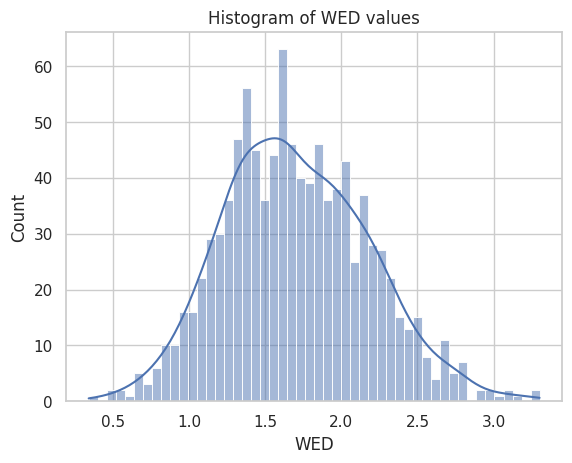

# RoofWireframePrediction

### Install required Packages (Add to the list):

1. `pip install cv2`
2. `pip install git+ssh://git@hf.co/usm3d/tools.git` 
3. `pip install open3d`

### Important functions: 
1. `triangulate_from_viewpoints` in the `utils.py` file takes all the views for a house, and the detected vertices in the 2D images, triangulates each pair (of the same class) from each pair of images and keeps the ones within some reprojection error. TODO :  Add an evaluation metric on howm many vertices we get close to the ground truth vertices - would help in independetly making this part of the project better.
2. `get_edges_with_support` in `utils.py` is used for deciding which of the triangulated 3D points should have an edge between them. Parameters can be tweaked as several edges are not classified as of now. Would help in saving the projected lines on top of the segmentation masks to see what is happening.
3. Use `visualize_triangulated_gt_vertices.py` to visualize a result in 3D

### Running the pipeline
The file `build_wireframes.py` is the main file, while most functions are in `HouseData.py` and `utils.py`
Most functions have an option to visualize to debug. You will need to have access to the (not public) hoho dataset on huggingface.

Note : The code is not clean and commented as this was intended for the USM3D S23DR workshop challenge and I am not building upon this solution at the moment.
This is meant as a handcrafted baseline for future solutions.
The report contains most details about the method. Feel free to raise a pull request if you notice a correction.

### Analysis

<!-- Insert plot -->
<table>
  <tr>
    <td align="center">
       
      <em>Distribution of WED over 1000 training scenes</em>
    </td>
  </tr>
</table>
